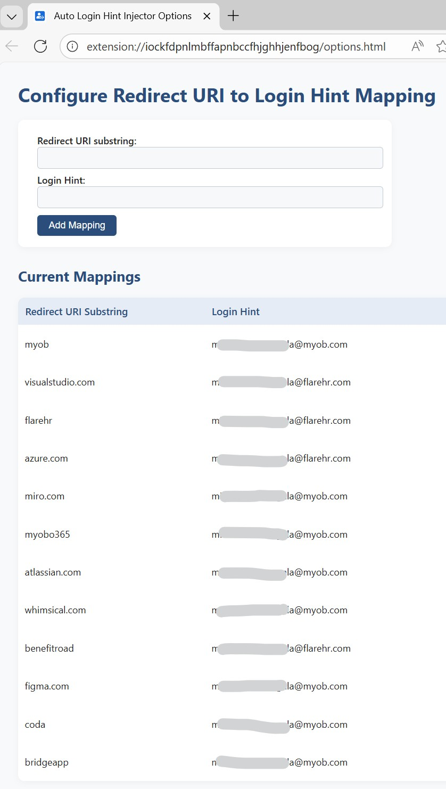

    

# Auto Login Hint Injector

## Intention
This browser extension automatically adds a `login_hint` parameter to authentication URLs based on user-defined mappings. By pre-filling the login hint, it can automatically log you in with the correct account—such as skipping the "choose an account" prompt when using Microsoft SSO or similar providers. This streamlines SSO and login flows, reducing friction and making authentication seamless for supported services.

## How to Configure the Plugin

1. Click the extension icon and select "Options" or open the options page from your browser's extension menu.
2. Add a new mapping:
    - **redirectUriSubstring**: A unique substring to match within the `redirect_uri` or `RelayState` value.
    - **loginHint**: The value to inject as the `login_hint` parameter.
3. Save your mappings. The extension will now automatically apply the login hint when a matching URL is detected.

Refer the example configuration below:

## How to Install the Plugin Locally
### Chrome / Edge
1. Download or clone this repository to your computer.
2. Open your browser and go to `chrome://extensions/` (or `edge://extensions/`).
3. Enable "Developer mode" (top right).
4. Click "Load unpacked" and select the folder containing this extension's files.
5. The extension should now appear in your browser's extension list.

### Firefox
1. Download or clone this repository to your computer.
2. Go to `about:debugging#/runtime/this-firefox` in Firefox.
3. Click "Load Temporary Add-on..." and select the `manifest.json` file from this extension's folder.
4. The extension will be loaded temporarily for testing.